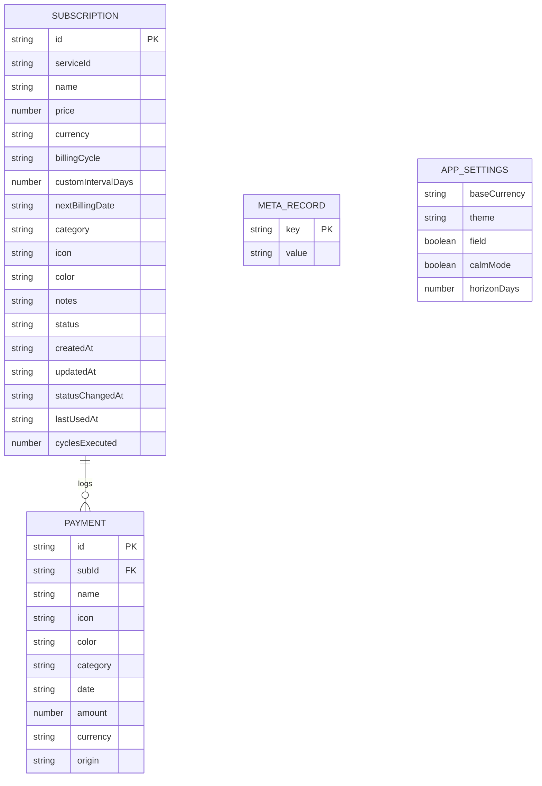
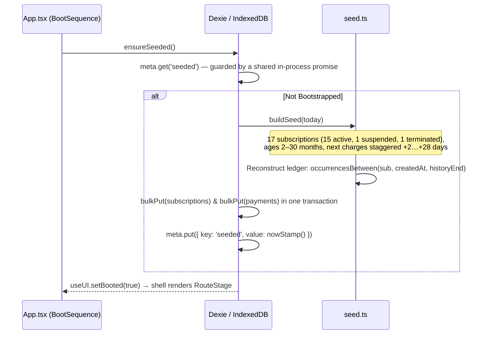

# SUBTRACK // ARCHITECTURAL SPECIFICATION & SYSTEM MANUAL
*A local-first, offline-capable Financial Operating System for recurring subscription management.*

> [!IMPORTANT]
> **MANDATE FOR AI AGENTS & DEVELOPERS (LIVING DOCUMENT PROTOCOL)**:
> This `AGENTS.md` file is the **single source of truth** for the entire Subtrack system.
> Whenever you modify, refactor, add features, update schemas, introduce new dependencies, or alter domain types/logic in this repository, you **MUST** update this file to reflect your changes immediately. Never allow this document to drift from active code.

---

## 1. Executive System Overview & Philosophy

### 1.1 Core Metaphor & Conceptual Model
Subtrack treats personal recurring finances not as passive spreadsheets, but as an **active operating system**:
- **Subscriptions are Processes**: A service you pay for is an ongoing background process running on your financial volume. It has a state (`active`, `suspended`, `terminated`), a cycle schedule, a resource consumption rate, and a deterministic subscription identifier (e.g. `SUB-41207`, generated by `pidOf()` in `src/lib/id.ts`).
- **Money is Resource Consumption**: Charges represent compute/resource cycles. Subtrack normalises all billing schedules (weekly, monthly, quarterly, yearly, custom) into **Burn Rate** — normalised currency consumed per month and per day.
- **Renewals are Scheduled Events**: A renewal is not an unexpected invoice; it is a deterministic occurrence on an execution schedule, always computed as `anchor + k × interval`.
- **Your Device is the Host Volume**: There is no remote backend, no user account, no cloud database, and no telemetry. All state lives inside local IndexedDB storage (via Dexie.js), and works 100% offline.

**Terminology rule**: user-facing copy says **"Subscriptions"**; the word **"process"** appears only in internal comments, identifiers and OS-metaphor semantics (see §16.2).

```
+-----------------------------------------------------------------------------------+
|                                 SUBTRACK HOST                                    |
|                                                                                   |
|  +-----------------------------------------------------------------------------+  |
|  |                             PRESENTATION LAYER                              |  |
|  |  +---------------+  +---------------+  +---------------+  +---------------+ |  |
|  |  |   OVERVIEW    |  |     FLOW      |  | PAYMENT MATRIX|  |   INSIGHTS    | |  |
|  |  |  (/)          |  | (/flow)       |  | (/time)       |  | (/data)       | |  |
|  |  +---------------+  +---------------+  +---------------+  +---------------+ |  |
|  +-----------------------------------------------------------------------------+  |
|                                        |                                          |
|  +-----------------------------------------------------------------------------+  |
|  |                        REACTIVE ORCHESTRATION LAYER                         |  |
|  |     Zustand UI Store  *  Dexie Live Queries  *  useSystem Reactive Hook     |  |
|  +-----------------------------------------------------------------------------+  |
|                                        |                                          |
|  +-----------------------------------------------------------------------------+  |
|  |                        BUSINESS LOGIC & ANALYTICS                           |  |
|  |    analytics.ts   *   money.ts   *   date.ts   *   cycle.ts   *   fuzzy.ts  |  |
|  +-----------------------------------------------------------------------------+  |
|                                        |                                          |
|  +-----------------------------------------------------------------------------+  |
|  |                           LOCAL STORAGE ENGINE                              |  |
|  |                    IndexedDB / Dexie.js (Schema V1, db "subtrack")          |  |
|  |           [subscriptions]        [payments]        [meta]                   |  |
|  +-----------------------------------------------------------------------------+  |
+-----------------------------------------------------------------------------------+
```

### 1.2 Non-Negotiable Engineering Principles
1. **Local-First & Offline Resilience**: The shell is precached by the service worker, writes go straight to IndexedDB, and the app remains fully functional with zero network connectivity. No feature may depend on a remote call.
2. **Deterministic Arithmetic**: Currency conversion uses a documented static FX table (never a live feed), and every currency string is produced by `Intl.NumberFormat`. Cycle dates are always derived from the anchor so the day-of-month never drifts.
3. **Hardware-Inspired Cyber Brutalism**: The interface evokes high-reliability industrial instruments and terminals: chamfered cut-corner panels, monospace telemetry, signal LEDs, hard rules, and micro labels — always subordinate to readability.
4. **Zero Telemetry**: No trackers, analytics pixels, remote fonts, or external API pings. Fonts are self-hosted; the FX table is a constant.

---

## 2. Repository Structure & Directory Topology

```
E:/Projects/Subtrack/
├── AGENTS.md                     # This document — single source of truth
├── README.md                     # Product overview, run instructions, architecture notes
├── index.html                    # HTML shell (theme boot script, pre-paint boot screen, PWA meta)
├── package.json                  # Dependencies & scripts
├── tsconfig.json                 # TypeScript strict config (TS 7, paths "@/*" -> "./src/*")
├── vite.config.ts                # Vite build, Tailwind, PWA (manifest: false), chunking
├── public/                       # Static PWA assets
│   ├── favicon.svg               # Vector SUBTRACK mark
│   ├── manifest.webmanifest      # Hand-authored manifest (icons + 3 app shortcuts)
│   ├── fonts/                    # Self-hosted variable fonts + SIL OFL licences
│   │   ├── space-grotesk-latin.woff2 / -latin-ext.woff2
│   │   ├── jetbrains-mono-latin.woff2 / -latin-ext.woff2
│   │   └── LICENSE-space-grotesk.txt / LICENSE-jetbrains-mono.txt
│   ├── icons/                    # Generated by scripts/generate-icons.mjs
│   │   ├── icon-192.png / icon-512.png / maskable-512.png / apple-touch-icon.png
│   └── textures/
│       └── noise.png             # 96px grain tile used by the background field
├── scripts/
│   ├── generate-icons.mjs        # Zero-dependency PNG encoder: draws icons + noise tile
│   └── smoke.mjs                 # Headless runtime smoke test (serves dist/, drives Chrome)
└── src/
    ├── app/
    │   └── nav.ts                # NAV_ITEMS (code, label, path, hotkey, blurb, icon), navItemFor()
    ├── components/
    │   ├── brand/
    │   │   ├── ServiceBadge.tsx  # Brand-accented glyph container (sm/md/lg/xl, tone ink|brand)
    │   │   ├── ServiceGlyph.tsx  # Official brand icon resolver (react-icons + custom SVGs)
    │   │   └── Wordmark.tsx      # Mark (CSS load bars) + "SUBTRACK // FINANCIAL OS" wordmark
    │   ├── charts/
    │   │   ├── BurnRail.tsx      # BurnSegments, BurnRail, BurnEdge — segmented load register
    │   │   ├── CategoryBlock.tsx # CategoryBar, CategoryDistribution, CompositionStrip, RadialGauge
    │   │   └── SpendingSignal.tsx# SVG signal trace: grid, crosshair, forecast region, a11y table
    │   ├── shell/
    │   │   ├── CommandPalette.tsx# Ctrl/⌘+K query engine (commands + subscription index)
    │   │   ├── CyberShell.tsx    # Layout route: rail, header, RouteStage, overlays, hotkeys
    │   │   ├── FieldOverlay.tsx  # Viewfinder brackets, coordinate scale, CRT band (desktop)
    │   │   ├── MobileNav.tsx     # 5-cell bottom console + burn edge strip + floating add key
    │   │   ├── NavigationRail.tsx# Desktop rack with sliding active plate + status stack
    │   │   ├── SystemFooter.tsx  # Minimal footer: counts, currency, creator credit
    │   │   ├── SystemHeader.tsx  # Instrument bar: module, status, clock, query trigger, CTA
    │   │   ├── SystemToaster.tsx # Console-log style toast stack (auto-dismiss / sticky)
    │   │   └── UpdatePrompt.tsx  # SW registration + "SYSTEM UPDATE AVAILABLE" reload prompt
    │   ├── subs/
    │   │   ├── IncomingStream.tsx# Forward-only renewal stream (DayGroups) + IncomingRail
    │   │   ├── ProcessCard.tsx   # Subscription module: ProcessCard (grid) / ProcessRow (list)
    │   │   ├── SubscriptionComposer.tsx # Add/Edit console with categorised preset gallery
    │   │   ├── SystemNotes.tsx   # Derived diagnostics (concentration, dormancy, clusters)
    │   │   ├── TerminateDialog.tsx # Two-step destruction alertdialog (terminate | purge)
    │   │   └── TerminationConsole.tsx  # Global overlay bound to store.termination
    │   └── ui/
    │       ├── AnimatedNumber.tsx# Spring odometer rendering through a MotionValue
    │       ├── Controls.tsx      # CyberSelect, SegmentedControl, ToggleSwitch, ArmedButton, FieldShell
    │       ├── CutPanel.tsx      # Chamfered panel system (CutPanel, Block, CutCorner)
    │       ├── CyberButton.tsx   # CyberButton (variants/sizes, kbd hint, busy) + IconButton
    │       ├── CyberDatePicker.tsx# Custom calendar popover (keyboard, relative jumps)
    │       ├── DataStrip.tsx     # DataStrip telemetry rail + SystemRail
    │       ├── Icons.tsx         # 24-box stroke icon set (square caps)
    │       ├── Micro.tsx         # MicroLabel, KeyCap, SectionHeader, HashRule
    │       ├── Signal.tsx        # Led, StatusChip, Tag, SIGNAL_* maps, STATUS_META
    │       └── Skeleton.tsx      # Skeleton, SkeletonPanel, BootScreen, EmptyState
    ├── hooks/
    │   ├── useElementWidth.ts    # ResizeObserver width tracking for pixel-exact SVGs
    │   ├── usePlatform.ts        # useClock, useMediaQuery, useOnline, useHotkeys,
    │   │                         # useFocusTrap, useScrollLock
    │   └── useSystem.ts          # Dexie live queries + memoised analytics pipeline
    ├── lib/
    │   ├── analytics.ts          # summarize(), viewOf(), series, streams, matrix, notes
    │   ├── catalog.ts            # 62 service presets with Indian pricing + tiers
    │   ├── cx.ts                 # Class name joiner
    │   ├── cycle.ts              # Cycle economics + anchor-based occurrence generation
    │   ├── date.ts               # ISO calendar-day engine (no timezone, no drift)
    │   ├── db.ts                 # Dexie schema, CRUD, snapshots — the only write path
    │   ├── fuzzy.ts              # parseQuery(), fuzzyScore(), searchSubscriptions()
    │   ├── id.ts                 # pidOf(), traceOf(), slotOf(), txnRef(), hash32()
    │   ├── money.ts              # Static FX, Intl formatting, percent helpers
    │   ├── portability.ts        # JSON snapshot export/import, CSV ledger, clipboard readout
    │   ├── seed.ts               # 17-subscription demo dataset + reconstructed ledger
    │   └── types.ts              # Domain interfaces, categories, signal maps
    ├── pages/
    │   ├── Overview.tsx          # "/" — burn hero, burn rail, signal, stream, grid, archive
    │   ├── Flow.tsx              # "/flow" — registry with query bar, filters, densities
    │   ├── ProcessDetail.tsx     # "/flow/:id" — diagnostic board for one subscription
    │   ├── PaymentMatrix.tsx     # "/time" — six-week matrix + 13-month rail + day panel
    │   ├── Insights.tsx          # "/data" — readouts, distribution, gauges, statistics
    │   ├── Settings.tsx          # "/sys" — skin, currency, horizon, volume, danger zone
    │   └── NotFound.tsx          # 404 terminal diagnostic view
    ├── store/
    │   └── ui.ts                 # Zustand store (persisted prefs, overlays, toasts, booted)
    ├── styles/
    │   ├── index.css             # Root imports + @custom-variant day
    │   ├── tokens.css            # Skin tokens (dark/day) + @theme inline Tailwind bridge
    │   ├── fonts.css             # @font-face for the 4 self-hosted variable woff2 files
    │   ├── base.css              # Reset, background field, focus, scrollbars, reduced motion
    │   └── components.css        # Panels, chamfers, signals, controls, animations
    ├── App.tsx                   # Router, ThemeSync, BootSequence, lazy routes + prefetch
    └── main.tsx                  # Entry point (mounts App, clears #boot)
```

---

## 3. Data Architecture & Type Definitions

The schema is defined in `src/lib/types.ts`.



### 3.1 Domain Schemas

#### `Subscription`
```typescript
export interface Subscription {
  id: string                   // UUID v4 (crypto.randomUUID)
  serviceId: string | null     // Preset catalog ID (e.g. 'netflix', 'claude') or null
  name: string                 // Display name
  price: number                // Nominal price in native currency
  currency: string             // ISO 4217 code ('INR' default, 9 supported)
  billingCycle: BillingCycle   // 'weekly' | 'monthly' | 'quarterly' | 'yearly' | 'custom'
  customIntervalDays?: number  // Only used when billingCycle === 'custom'
  nextBillingDate: string      // ISO date 'YYYY-MM-DD' — also the cycle ANCHOR (k = 0)
  category: Category           // One of the 9 categories below
  icon: string                 // Glyph key resolved by ServiceGlyph
  color: string                // Hex accent used by ServiceBadge (e.g. '#10A37F')
  notes: string                // Free-text annotation (max 500 chars in the composer)
  status: ProcessStatus        // 'active' | 'suspended' | 'terminated'
  createdAt: string            // ISO date 'YYYY-MM-DD' — history is derived from here
  updatedAt: string            // ISO timestamp 'YYYY-MM-DDTHH:MM:SS'
  statusChangedAt?: string     // ISO date the status last changed (suspend/terminate)
  lastUsedAt?: string          // ISO date the user last confirmed active usage
  cyclesExecuted: number       // Monotonic count of billing cycles executed
}
```

#### `Payment`
A concrete charge. Denormalised display fields survive a subscription purge.
```typescript
export interface Payment {
  id: string
  subId: string
  name: string                  // Denormalised service name
  icon: string                  // Denormalised glyph key
  color: string                 // Denormalised accent
  category: Category            // Denormalised category
  date: string                  // ISO 'YYYY-MM-DD' charge date
  amount: number                // Charged in the subscription's native currency
  currency: string
  origin: 'derived' | 'confirmed' // 'derived' = reconstructed from the schedule; 'confirmed' = user executed
}
```

#### `Category` — 9 discrete semantic domains
```typescript
export type Category =
  | 'ai'             // AI & Intelligence (ChatGPT, Claude, Gemini, Cursor, Perplexity)
  | 'entertainment'  // Streaming & Media (Netflix, Disney+ Hotstar, Crunchyroll, Max)
  | 'productivity'   // Work & Design (Notion, Figma, Slack, Jira, Linear, Adobe)
  | 'cloud'          // Infrastructure & Storage (Google One, iCloud+, Dropbox, Supabase)
  | 'music'          // Audio (Spotify, Apple Music, Tidal, SoundCloud, Audible)
  | 'fitness'        // Health & Training (cult.fit, Strava, Fitbit, Headspace)
  | 'education'      // Learning & Reading (Coursera Plus, Duolingo, Medium, Substack)
  | 'shopping'       // Delivery & Memberships (Amazon Prime, Swiggy One, Zomato Gold)
  | 'other'          // Security & Utilities (1Password, Bitwarden, NordVPN, Proton)
```

`CATEGORIES` (in `types.ts`) carries `{ id, label, code }`:
`AI` · `ENT` · `PRD` · `CLD` · `MUS` · `FIT` · `EDU` · `SHP` · `OTH`.

Each category maps to a semantic signal colour via `CATEGORY_SIGNAL`:
`ai → acid` · `entertainment → magenta` · `productivity → blue` · `cloud → blue` ·
`music → orange` · `fitness → red` · `education → magenta` · `shopping → orange` · `other → acid`.

`CYCLE_LABEL` / `CYCLE_SHORT` provide human (`Weekly`) and telemetry (`WK`) forms.

---

## 4. Local Database & Storage Engine (`src/lib/db.ts`)

Subtrack uses [Dexie.js](https://dexie.org/) as an async typed wrapper over IndexedDB. **All writes go through the functions in this file — no view may touch a table directly.** This is the single seam where a sync engine could later attach.

### 4.1 Schema Declaration
Database name: `subtrack` (`DB_NAME`, exported). Dexie class: `SubTrackDB`.
```typescript
class SubTrackDB extends Dexie {
  subscriptions!: Table<Subscription, string>
  payments!: Table<Payment, string>
  meta!: Table<MetaRecord, string>

  constructor() {
    super('subtrack')
    this.version(1).stores({
      subscriptions: 'id, status, category, nextBillingDate, name, createdAt, updatedAt',
      payments: 'id, subId, date, [subId+date]',
      meta: 'key',
    })
  }
}
```
`meta` rows used: `seeded` (boot marker) and `schema` ('1').

### 4.2 Seed Workflow & History Reconstruction

History is **reconstructed from each subscription's own anchor** and capped at `statusChangedAt`, so a terminated process stops charging at its termination date. Seeded payments use `origin: 'derived'`.

### 4.3 Write API (Lifecycle Actions)
| Function | Behaviour |
| :--- | :--- |
| `createSubscription(draft: SubscriptionDraft)` | Assigns a UUID, sets `createdAt = today`, backfills `derived` payments if the anchor is in the past, returns the created `Subscription`. |
| `updateSubscription(id, patch, opts?)` | Merges the patch; when price/currency change (or `rebuildHistory: true`) it rebuilds that subscription's ledger from the anchor and resets `cyclesExecuted`. |
| `executeCycle(id, date?)` | Records a `confirmed` payment on the anchor, advances `nextBillingDate` one interval (`occurrenceAt(sub, 1)`, falling back to `rollForward` past today), increments `cyclesExecuted`, refreshes `lastUsedAt`. |
| `rollForward(sub, past)` | Advances a stale anchor past `past`, preserving the original day-of-month via `occurrenceAt`. Returns `{ date, skipped }`. |
| `reconcileSchedules()` | Explicit repair pass (Settings → RECONCILE): rolls every overdue active anchor forward. Returns the count repaired. |
| `setProcessStatus(id, status)` | Transitions `active`/`suspended`/`terminated`; sets `statusChangedAt` (cleared when returning to active). |
| `markUsed(id)` | Sets `lastUsedAt = today` — resets the dormancy timer used by analytics. |
| `purgeSubscription(id)` | **Deletes the subscription AND all of its payment history.** The terminate dialog states this explicitly. |
| `wipeAll()` / `resetToSeed()` | Destructive maintenance. Both clear `meta`; `resetToSeed()` re-seeds immediately. Both are dual-confirm (ArmedButton / TerminateDialog). |
| `exportSnapshot(settings)` / `importSnapshot(snapshot, mode)` | Portable `Snapshot { app:'subtrack', version:1, exportedAt, settings, subscriptions, payments }`. `mode` is `'replace'` (clears first) or `'merge'` (`bulkPut`). Returns an `ImportReport`. |

Read helpers: `listSubscriptions()`, `getSubscription(id)`, `listPayments()`, `paymentsFor(subId)`.
`SubscriptionDraft` is the accepted shape for create/update (name, serviceId, price, currency, billingCycle, customIntervalDays, nextBillingDate, category, icon, color, notes).

---

## 5. Calculation Engine & Financial Analytics (`src/lib/analytics.ts`)

Analytics are pure functions over `(subscriptions, payments, baseCurrency, today)`. Nothing is random, nothing is dressed up as intelligence — every "system note" is arithmetic.

### 5.1 Burn Rate Normalisation
With nominal price $P$, billing cycle $C$ and custom interval `days`:
$$\text{MonthlyFactor}(C) = \begin{cases}
365.25/7/12 \approx 4.3482 & C = \text{weekly}\\
1 & C = \text{monthly}\\
4/12 = 1/3 & C = \text{quarterly}\\
1/12 & C = \text{yearly}\\
30.4375/\text{days} & C = \text{custom}
\end{cases}$$

$$\text{Monthly} = \text{convert}(P \times \text{MonthlyFactor},\ \text{sub.currency},\ \text{base})$$
$$\text{Annual} = \text{Monthly} \times 12 \qquad \text{Daily} = \text{Monthly} / 30.4375$$

`cyclesPerYear()` / `monthlyCost()` / `annualCost()` in `src/lib/cycle.ts` implement this. Annual billing therefore *understates* the month it lands in — the Cash signal exposes the real spike.

### 5.2 Subscription View (`viewOf`)
```typescript
export interface SubscriptionView {
  sub: Subscription
  monthly: number   // Normalised monthly burn in the base currency
  annual: number    // monthly * 12
  next: RelativeDay & { date: string } // { days, label, overdue, date }
  share: number     // 0..1 of total monthly burn (0 when total is unknown)
}
```
`viewOf(sub, base, today, total)` builds one; `summarize()` builds sorted views for every active subscription (descending monthly cost).

### 5.3 System Summary Pipeline (`summarize()`)
`summarize(subscriptions, payments, base, today)` compiles, in a single pass:
- **`active` / `suspended` / `terminated`** arrays and `activeCount`.
- **`monthlyBurn`** (normalised run-rate of active subscriptions), **`annualLoad = monthlyBurn × 12`**, **`dailyBurn`**, **`avgCost`**.
- **`highest` / `lowest`** views, **`views`** (sorted, share-weighted).
- **`runRateDelta`** — burn today vs `burnAt(previous calendar month)` (`+4.8% VS PREVIOUS CYCLE`).
- **`cashDelta`**, **`thisMonthCash`**, **`prevMonthCash`** — recorded cash this cycle vs last (`cashAt()` joins the ledger to scheduled occurrences).
- **`nextPayment`**, **`incoming7`**, **`incoming30`**, **`incoming30Total`**, **`overdue`** (see §5.4).
- **`categories: CategorySlice[]`** — `{ category, label, code, signal, monthly, annual, count, share }`, sorted by monthly cost.
- **`concentration`** — top-3 combined share of burn (e.g. `61%`).
- **`dormant`** — views with `lastUsedAt` ≥ 30 days old (or never), with days since last use.
- **`longestRunning`** — view with the highest `cyclesExecuted`.
- **`notes: SystemNote[]`** — up to 6 diagnostics: concentration, category momentum, dormancy, 7-day load clusters, new subscriptions this cycle, uptime record, overdue cycles.

### 5.4 Streams, Series & Matrix
- **`incomingStream(subs, base, today, horizonDays = 30)`** — strictly **forward-looking** scheduled charges (`days ≥ 0`), ascending, each carrying a running `cumulative` total. History is the ledger's job; this window is the future.
- **`overdueStream(subs, base, today)`** — active subscriptions whose anchor has already passed without confirmation. Derived from the anchor, not the charge window, so recorded history is never misread as "overdue".
- **`buildSignalSeries(subs, payments, base, today, mode, back, forward)`** — `SeriesPoint[]` with `kind: 'actual' | 'current' | 'projected'`. Two modes: `'runrate'` (normalised burn per month via `burnAt()`) and `'cash'` (recorded ledger amounts via `cashAt()`, joined with scheduled occurrences for the current/future months).
- **`paymentSeriesFor(payments, base, months, today)`** — per-subscription recorded monthly cash (used by the diagnostic panel).
- **`matrixFor(subs, base, startISO, endISO)`** — `Map<ISODate, ProcessEvent[]>` of every scheduled charge in a window; powers the Payment Matrix and the 13-month rail.

---

## 6. Currency & FX Architecture (`src/lib/money.ts`)

Subtrack operates on a **static reference table keyed to the Indian Rupee**. No network calls, no live rates — the same numbers every time the console opens. `BASE_CURRENCY = 'INR'`.

### 6.1 Supported Currencies & FX Matrix
`perINR[currency]` = units of that currency per **1 INR**:
```typescript
export const CURRENCIES: CurrencyDef[] = [
  { code: 'INR', locale: 'en-IN', symbol: '₹',  perINR: 1,        decimals: 2 },
  { code: 'USD', locale: 'en-US', symbol: '$',  perINR: 1 / 83.4, decimals: 2 },
  { code: 'EUR', locale: 'en-IE', symbol: '€',  perINR: 1 / 90.2, decimals: 2 },
  { code: 'GBP', locale: 'en-GB', symbol: '£',  perINR: 1 / 105.8, decimals: 2 },
  { code: 'AED', locale: 'en-AE', symbol: 'AED', perINR: 1 / 22.7, decimals: 2 },
  { code: 'SGD', locale: 'en-SG', symbol: 'S$', perINR: 1 / 62.1, decimals: 2 },
  { code: 'AUD', locale: 'en-AU', symbol: 'A$', perINR: 1 / 54.6, decimals: 2 },
  { code: 'CAD', locale: 'en-CA', symbol: 'C$', perINR: 1 / 60.9, decimals: 2 },
  { code: 'JPY', locale: 'ja-JP', symbol: '¥',  perINR: 1 / 0.55, decimals: 0 },
]
```
`currencyDef(code)` falls back to INR for unknown codes; `symbolOf()` returns the raw symbol.

### 6.2 Conversion Formula
$$\text{convert}(A, S \to T) = \frac{A}{\text{perINR}[S]} \times \text{perINR}[T]$$
`toBase()` / `fromBase()` are thin aliases. Amounts are converted at read time; the stored `price`/`amount` are always in the subscription's native currency.

### 6.3 Money Formatting
- `formatMoney(amount, currency)` — `Intl.NumberFormat` with the currency's locale; 0 decimals for whole amounts, 2 for fractional (JPY always 0). Produces `₹649`, `₹1,299`, `₹12,480`, `₹1,49,760`, `$7.78`.
- `formatCompact(amount, currency)` — compact notation (`₹12.5K`, `₹1.5L`) for rails and chips.
- `splitMoney(amount, currency)` — `{ symbol, value }` so the hero can set symbol and digits at different weights.
- `formatNumber(value, decimals)` — plain `en-IN` grouping.
- `formatPercent(value, decimals = 2)` — signed with the Unicode minus (`+4.82%` / `−1.20%`).
- `percentChange(current, previous)` — the delta used by `runRateDelta` / `cashDelta`.

**Never build a currency string by hand.** Every amount in the UI passes through these helpers.

---

## 7. Date Arithmetic & Deterministic Engine (`src/lib/date.ts`)

All dates are plain ISO calendar days (`YYYY-MM-DD`) with no time component and no timezone. Internals use UTC day numbers, so DST can never shift a billing date.

### 7.1 Anchor-Preserving Month Addition (`addMonthsClamped`)
Adding 1 month to January 31 produces February 28/29, but the anchor day (31) is never lost:
```typescript
export function addMonthsClamped(iso: string, months: number): string {
  const { y, m, d } = parseISO(iso)
  const total = y * 12 + (m - 1) + months
  const ny = Math.floor(total / 12)
  const nm = (total % 12) + 1
  return toISO(ny, nm, Math.min(d, daysInMonth(ny, nm)))
}
```
Core exports: `toISO`, `parseISO`, `todayISO`, `daysInMonth`, `isLeapYear`, `dayNumber`, `fromDayNumber`, `diffDays(a, b) = a − b` (whole days), `addDaysISO`, `startOfMonthISO`, `endOfMonthISO`, `isWeekend`, `weekdayIndexMon` (Monday-first).

Month keys & labels: `monthKey(iso) → 'YYYY-MM'`, `shiftMonthKey(key, delta)`, `monthKeyParts`, `monthKeyLabel → 'SEP 2026'`, `monthKeyShort → 'SEP'`.

Stamps: `formatSignalDate → '19 SEP 2026'` (canonical), `formatDotDate → '09.15'` (rails/streams), `formatClock → '13:07:42'`, `nowStamp → 'YYYY-MM-DDTHH:MM:SS'`.

Relative time & calendar: `relativeDay(iso, today)` → `{ days, label, overdue }` (`TODAY`, `TOMORROW`, `2 DAYS LATE`, `3 WEEKS`…), `monthMatrix(y, m, today)` → a fixed **6×7 Monday-first grid (42 cells)** with `{ iso, day, inMonth, isToday, isWeekend, monthKey }`, plus `WEEKDAYS_MON`.

### 7.2 Cycle Occurrence Computation (`src/lib/cycle.ts`)
Occurrences are computed as **`anchor + k × interval`** — never by stepping — so a subscription anchored on the 31st keeps charging on the 31st.
```typescript
// cycle.ts — occurrenceAt(sub, k); k = 0 is nextBillingDate, negative k walks into history
weekly    → addDaysISO(anchor, 7k)
monthly   → addMonthsClamped(anchor, k)
quarterly → addMonthsClamped(anchor, 3k)
yearly    → addMonthsClamped(anchor, 12k)
custom    → addDaysISO(anchor, customIntervalDays × k)
```
- `occurrencesBetween(sub, from, to)` — bounded scan (`MAX_STEPS = 900`) seeded by a day-estimate so both past and future windows resolve without loops.
- `nextOccurrence(sub, after)` — smallest occurrence strictly after `after`.
- `occurrencesByMonth(sub, fromMonth, toMonth)` — charges bucketed by `'YYYY-MM'` (the card's 12-month register).
- `cycleSuffix()` / `cycleNoun()` / `cycleStamp()` / `cyclesPerMonth()` — label helpers (`'/ MONTH'`, `'YEARLY'`, `'EVERY 14 DAYS'`).

---

## 8. Fuzzy Search & Command Query Parser (`src/lib/fuzzy.ts`)

One engine serves the Command Palette and the Flow query bar. **Every term must match** — queries narrow.

### 8.1 Query Syntax & Filter Extraction (`parseQuery`)
| Token | Meaning |
| :--- | :--- |
| `>500` / `<200` | Nominal price threshold |
| `>=200` / `<=200` | Accepted, normalised to `>` / `<` |
| `649` or `=649` | Exact amount (tolerance ±0.5) |
| `monthly` `yearly` `weekly` `quarterly` `custom` (+ `mo`, `yr`, `wk`) | Billing cycle filter |
| `active` `suspended` `terminated` (`on` / `off`) | Status filter |
| `ai`, `enter…`, `prod…` (≥3 chars) | Category prefix match |
| `sep`, `oct` (≥3 chars) | Month of the next billing date |
| `2026-09` | Exact month key |
| `19/09` or `19.09` | Day-of-month + partial month match |
| `2026` | Year of the next billing date |

Anything else is a free-text term matched against `NAME, CAT, CYCLE, AMOUNT (formatted + raw), NEXT (formatted + raw), PID, NOTES, STATUS, CCY, BASE`. Hard filters (amount/cycle/category/status/month/day/year) exclude before scoring.

### 8.2 Scoring (`fuzzyScore` / `searchSubscriptions`)
Per term, the best field score wins:
1. Exact match `+100`
2. Prefix match `+86`
3. Substring match `+72 − min(index, 24)`
4. In-order subsequence (typo tolerance) `+26 + min(best streak, 8)`

All terms must score > 0; totals are summed. A pure filter query (no free terms) returns every selected record with score `1`. Results sort by score, then name. The palette reuses the same engine (`searchSubscriptions`) and scores commands with `fuzzyScore(label)` vs `fuzzyScore(hint) − 10`.

---

## 9. Brand & Icon Resolver (`src/components/brand/ServiceGlyph.tsx`)

Every subscription displays an official brand vector mark from `react-icons` (Simple Icons, FontAwesome 6, Remix Icon, Tabler Icons) or one of the hand-built custom marks. Marks render in single-colour ink (`currentColor`); the **container** (`ServiceBadge`) carries the brand accent, so a wall of presets never becomes a rainbow.

### 9.1 Brand Registry (`OFFICIAL_ICONS`)
~90 keys map to icon components. Highlights:
- **Custom SVG components** (no Simple Icon exists): `CanvaIcon` (official script vector), `CultfitIcon` (geometric mark), `CursorIcon` (isometric cube), `DeepSeekIcon` (neural star), `OpenRouterIcon` (node router), `MidjourneyIcon` (sailboat), `ProcessIcon` (generic grid mark).
- **AI**: `chatgpt`/`openai → RiOpenaiFill`, `claude`/`anthropic → SiClaude`, `gemini → SiGooglegemini`, `perplexity`, `copilot → SiGithubcopilot`, `cursor`, `deepseek`, `openrouter`, `midjourney`.
- **Entertainment/Music**: `netflix`, `spotify`, `youtube`, `prime`/`amazon → FaAmazon`, `hotstar`/`disney → TbBrandDisney`, `appletv`, `crunchyroll`, `max`/`hbo`, `paramount`, `applemusic`, `audible`, `tidal`, `deezer`, `soundcloud`.
- **Productivity/Dev/Cloud**: `notion`, `figma`, `canva`, `adobe → TbBrandAdobe`, `microsoft → FaMicrosoft`, `linear`, `slack → FaSlack`, `jira`, `miro`, `github`, `copilot`, `gitlab`, `vercel`, `supabase`, `docker`, `kubernetes`, `aws → FaAws`, `digitalocean`, `cloudflare`, `googleone → TbBrandGoogleOne`, `googledrive`, `icloud`, `dropbox`.
- **Security**: `onepassword`, `bitwarden`, `nordvpn`, `proton` (+`protonmail`, `protonvpn`), `lastpass`, `expressvpn`.
- **Fitness/Learning**: `cultfit`, `strava`, `fitbit`, `peloton`, `headspace`, `coursera`, `duolingo`, `medium`, `substack`, `patreon`.
- **Gaming/Social/India**: `playstation`, `xbox → FaXbox`, `nintendo`, `discord`, `x`/`twitter → SiX`, `linkedin → FaLinkedin`, `twitch`, `steam`, `zoom`, `telegram`, `whatsapp`, `reddit`, `instagram`, `tiktok`, `swiggy`, `zomato`, `uber`, `airbnb`, plus `apple`, `google`, `amazon`, `youtube`.

### 9.2 Resolution Order & Fallback (`resolveIcon`)
1. Exact registry key (`'netflix'`).
2. Key with separators stripped (`'youtube-premium' → 'youtubepremium'`).
3. Keyword `includes()` rules — e.g. `'gpt' → OpenAI`, `'photoshop'/'illustrator' → Adobe`, `'office'/'365'/'onedrive' → Microsoft`, `'psplus' → PlayStation`, `'gamepass' → Xbox`, `'k8s' → Kubernetes`, `'curefit'/'cult' → CultfitIcon`.
4. **Fallback**: a bold geometric monogram of the service's initial character, rendered in JetBrains Mono inside the themed `ServiceBadge`.

`ServiceBadge` (`components/brand/ServiceBadge.tsx`) draws the container: hairline border tinted with the brand colour, a 10% brand wash, a 3px brand strip on the base edge, sizes `sm|md|lg|xl`, `tone: 'ink' | 'brand'`, and a `dimmed` state for suspended/terminated records. `ServiceGlyph` props: `{ size, className, fallback, style }`. `GLYPH_KEYS` exports the registry keys.

---

## 10. User Interface & Design System (`src/styles/`)

Subtrack employs a **Financial Cybercore / Cyber Brutalist** design system. Two skins — **Night (primary)** and **Daylight (white brutalist reprint)** — share one token API defined in `src/styles/tokens.css`. Any surface can be forced back to the dark skin with `[data-skin='dark']`, which is how black chips stay black inside the daylight theme.

### 10.1 Color System & Tokens (`tokens.css`)
```
================================================================================
TOKEN           NIGHT (DARK MODE)                DAYLIGHT (LIGHT MODE)
================================================================================
--c-bg          #050505                          #F2F1EC  (warm paper)
--c-bg-2        #0A0A0B                          #E9E8E1
--c-surface     #0E0E10                          #FFFFFF
--c-surface-2   #151518                          #F8F7F2
--c-surface-3   #1D1D21                          #ECEBE4
--c-line        rgb(244 244 244 / 0.11)          rgb(10 10 10 / 0.16)
--c-line-strong rgb(244 244 244 / 0.24)          rgb(10 10 10 / 0.42)
--c-line-hard   #F4F4F4                          #0A0A0A
--c-fg          #F4F4F4                          #0A0A0A
--c-fg-dim      rgb(244 244 244 / 0.63)          rgb(10 10 10 / 0.66)
--c-fg-faint    rgb(244 244 244 / 0.38)          rgb(10 10 10 / 0.42)
--c-shadow-hard #F4F4F4                          #0A0A0A
--c-acid        #B7FF00                          #B7FF00  (fill unchanged)
--c-blue        #00C8FF                          #00C8FF
--c-magenta     #FF2BD6                          #FF2BD6
--c-orange      #FF7A00                          #FF7A00
--c-red         #FF304F                          #FF304F
--c-acid-ink    #B7FF00 (text)                   #4A6B00  (text-safe on paper)
--c-blue-ink    #00C8FF                          #005E80
--c-magenta-ink #FF2BD6                          #AD0089
--c-orange-ink  #FF7A00                          #A04D00
--c-red-ink     #FF304F                          #C00020
--c-focus       #B7FF00                          #0A0A0A
--c-*-soft      12–14% signal washes             14–28% signal wash
--glow-acid     1px ring + 26px bloom            none (daylight is flat)
================================================================================
```
The tokens are bridged into Tailwind via `@theme inline` in `tokens.css`, producing utilities that follow the active skin: `bg-bg`, `bg-bg2`, `bg-surface`, `bg-surface2`, `bg-surface3`, `border-line`, `border-line2`, `border-linehard`, `text-fg`, `text-dim`, `text-faint`, `text-acid`, `text-acidink` (text-safe variant), `bg-acidsoft`, `text-hero/display/numeral/meta/micro`, `ease-snap`, `ease-out-quint`. `index.css` declares `@custom-variant day (&:where([data-theme='day'], [data-theme='day'] *))`. Any element may re-enter the dark skin with `data-skin='dark'`.

Other token groups: geometry (`--bd`/`--bd-2`/`--bd-3`, chamfers `--cut-xs 4px → --cut-lg 20px`, grid pitches `--pitch 28px` / `--pitch-fine 7px`, offset `--shadow-x 4px`), motion (`--t-micro 110ms → --t-page 400ms`, `--ease-snap`, `--ease-out`, `--ease-in-out`), and type (`--fs-hero` clamp → `--fs-micro 10px`).

### 10.2 Chamfer Geometry (`components.css`)
Because `clip-path` also clips `box-shadow`, chamfered panels are a **two-layer system**:
- `CutPanel` (`components/ui/CutPanel.tsx`) renders `.cp` (unclipped wrapper) → optional `.cp-shadow` (the solid offset block, `clip-cut*` + `translate: 4px 4px`) → `.cp-frame` (background = border colour, `clip-cut*`) → `.cp-in` (surface, `clip-path: inherit`). The offset block is a real element, which keeps brutalist offsets crisp on both skins.
- Crop variants: `clip-cut` (top-left **and** bottom-right — the signature), `clip-cut-tr`, `clip-cut-br`, `clip-cut-tl`, `clip-cut-bl`. Depth is set per instance with `--_cut`.
- `Block` is the lighter bordered sibling for dense lists (optional single-corner crop).
- Supporting classes: `.panel`, `.panel-2`, `.panel-well`, `.frame-hard`, `.chip`, `.led` (+`led-lg`, `led-hollow`), `.hazard`, `.ticks`/`.ticks-v`, `.rule`/`.rule-hard`/`.rule-dotted`, `.scanlines`, `.grid-field`, `.dot-field`, `.future-flow`, `.chroma`, `.btn-core` + variants (`btn-solid`, `btn-ink`, `btn-ghost`, `btn-danger`, `btn-icon`), `.field`, `.rail`, `.bleed-rail`, `.safe-b/t/x`, `.skeleton`, `.skeleton::after` shimmer.
- Keyframes: `shimmer`, `blink`, `pulse-led`, `scanline`, `marquee`, `drift`, `dashdraw`, `glitch-shift` (the route-change sweep, the only glitch in the product), `reveal-in` (scroll-driven via `animation-timeline: view()` where supported).

### 10.3 Typography Hierarchy
- **UI display & headers**: `Space Grotesk Variable` (300–700), self-hosted woff2 (latin + latin-ext).
- **Financial telemetry & numerals**: `JetBrains Mono Variable` (100–800), self-hosted woff2 (latin + latin-ext). ~96 KB total; licences in `public/fonts/LICENSE-*.txt`.
- Micro labels (`.micro`, `.tech-label`, `.pid`, `.meta`) are mono with wide tracking; hero numerals (`.numeral`) use `tabular-nums` and `letter-spacing: -0.045em`.
- **`src/styles/fonts.css`** declares the four `@font-face` rules with `unicode-range` splits and `font-display: swap`. No remote font requests.

---

## 11. Core Feature Boards & Pages (`src/pages/`)

### 11.1 Overview (`/`)
The main flight deck:
- **Hero**: `MONTHLY BURN` with a spring-odometer numeral, `+Δ VS PREVIOUS CYCLE`, daily burn, and the next-transaction card (service, date, countdown).
- **Readout strip** (`DataStrip`): projected annual load, active subscriptions, average, highest cost, top category, charges inside the horizon.
- **Load Distribution (`BurnRail`)**: segmented register of the whole burn; segments are coloured by **category signal**, interactive (hover/tap → readout), with a category legend.
- **Right column**: System notes (3 most recent), the 7-day load cluster sparkline, the dominant category card.
- **Spending Signal**: `runrate`/`cash` toggle with the drawn SVG trace.
- **Incoming // next 30 days**: full `IncomingStream` on desktop, `IncomingRail` on mobile.
- **Active subscriptions grid**: up to 8 `ProcessCard`s + "load remaining" link; plus an **Archive** rail for suspended/terminated records.
- Empty system → `NO ACTIVE SUBSCRIPTIONS / SYSTEM IS CURRENTLY CLEAN.` with the add CTA.

### 11.2 Flow (`/flow`)
The central subscription registry:
- **Query bar**: full keyword, status, category and numeric filter engine (§8), with a live match count.
- **Filter rail**: status (ALL/ACTIVE/SUSPENDED/TERMINATED), category codes with counts, sort (monthly cost / next cycle / name / cycles run) — reflows into columns on XL screens.
- **Selection readout**: records in view, monthly burn in view, annualised, average, active filter summary.
- **Density switcher**: module **grid** (ProcessCard) or high-density **list** (ProcessRow).

### 11.3 Subscription Diagnostic Detail (`/flow/:id`)
Hardware-inspired diagnostic station for one subscription:
- **Identity & economics header**: shared-layout badge (`layoutId: glyph-{id}`), nominal price odometer, normalised readout, next-cycle block with countdown.
- **Control rail**: Edit (opens the composer), Confirm Cycle (execute + advance), Suspend/Resume, Terminate Subscription / Purge Record (via the global `TerminationConsole`).
- **Metadata register**: cycles executed, initialized, age, last marked used, anchor day, interval, status-changed, last write.
- **Lifetime readout strip**: share of burn, lifetime charged, recorded charges, next occurrence +1, projected 12-month, days since anchor.
- **Payment history ledger**: reverse-chronological table with `TXN-…` references and `CONFIRMED`/`SCHEDULED` origin chips.
- **Spending signal**: per-subscription monthly cash via `paymentSeriesFor()`.
- Unknown id → `SUBSCRIPTION NOT FOUND` empty state.

### 11.4 Payment Matrix (`/time`)
Forward/backward financial projection:
- **Thirteen-month rail**: 3 past + current + 9 future months, each showing compact total and event count; today is LED-marked.
- **Month readouts**: scheduled outflow, events, active days, peak day, average per event.
- **Six-week matrix (42 cells)**: per-day charge markers, desktop named charges, category composition strip, `future-flow` tint for days ahead of today, today stamped in acid.
- **Day panel**: desktop side panel / mobile bottom sheet listing the day's charges with base-currency conversion and the day total.

### 11.5 Insights (`/data`)
Deep financial intelligence:
- **Headline readouts**: monthly burn (emphasis), annual load, active subscriptions, average, highest cost.
- **Composition strip + category blocks**: full-width stacked composition, then per-category segmented bars with counts, monthly cost and share.
- **Radial instruments**: top-3 concentration, activity ratio (active ÷ total tracked), dormant load (30d+), with tick-ring SVG arcs.
- **Signal history**: 11 months back + 1 forward, `cash`/`runrate` toggle.
- **Statistics table**: burn, load, daily rate, averages, highest/lowest, lifetime charged, charges in the last 30 days, longest running, newest, currencies in use, static FX reference.
- **Billing cycle mix**: monthly/quarterly/yearly/custom distribution with shares, plus observations and system notes.

### 11.6 Settings (`/sys`)
System control and backup room:
- **Appearance**: `NIGHT // PRIMARY` vs `DAYLIGHT // BRUTALIST`, background grid toggle, calm motion mode.
- **Aggregation currency**: 9-currency select + the full static FX reference table (per 1 base, and 1 unit → base).
- **Incoming horizon**: 7/14/30/60/90 days + RECONCILE SCHEDULES (rolls overdue anchors forward).
- **Local volume**: counts, oldest record, export JSON snapshot, export CSV ledger, import snapshot (replace mode, applies snapshot settings).
- **Keyboard register**: every shortcut with keycaps.
- **Destructive operations**: reset to demo dataset / purge all data — both two-press (`ArmedButton`).
- **About**: build, schema, storage, runtime, fonts, creator credit (Hariharen — https://hariharen.site).

---

## 12. Application State & Global Store (`src/store/ui.ts`)

Global UI state is handled by Zustand. Preferences persist to `localStorage` under `subtrack.ui` (partialized: `theme`, `field`, `calmMode`, `baseCurrency`, `horizonDays`); `ThemeSync` in `App.tsx` additionally mirrors the theme to `subtrack.theme` for the pre-paint boot script in `index.html`.

```typescript
interface SystemToast { id: string; kind: 'ok'|'info'|'warn'|'alert'|'busy'; label: string; text?: string; sticky?: boolean }

interface UIState {
  // Preferences (persisted)
  theme: 'dark' | 'day'
  field: boolean            // background grid + grain overlay
  calmMode: boolean         // suppresses decorative motion on top of the OS setting
  baseCurrency: string      // aggregation + display currency
  horizonDays: number       // incoming stream window (7–90)

  // Overlays (transient)
  toasts: SystemToast[]     // max 4, console-log semantics
  paletteOpen: boolean
  composer: { open: boolean; editId: string | null; presetServiceId: string | null }
  termination: { open: boolean; subId: string | null; mode: 'terminate' | 'purge' }

  // Boot
  booted: boolean           // false until the local volume is opened/seeded
  setBooted: (booted: boolean) => void

  // Actions
  setTheme / toggleTheme / setField / setCalmMode / setBaseCurrency / setHorizonDays
  pushToast(toast) / dismissToast(id) / clearToasts()
  setPaletteOpen(open) / togglePalette()
  openComposer(opts?: { editId?: string; presetServiceId?: string }) / closeComposer()
  openTermination(subId: string, mode: 'terminate' | 'purge') / closeTermination()
}
```
`TOAST_VERBS` provides the system verbs (`initialized`, `updated`, `suspended`, `resumed`, `terminating`, `terminated`, `purged`, `cycle`, `info`, `warn`, `error`) and `announce()` pushes toasts from non-React call sites. Overlay modals (composer, termination console) live at shell level in `CyberShell` so they survive navigation and are driven purely by store actions.

---

## 13. Global Keyboard Shortcut Register

| Shortcut | Scope | Action |
| :--- | :--- | :--- |
| `⌘ + K` or `Ctrl + K` | Global | Toggle Command Palette |
| `/` | Global | Open Command Palette (query field focused) |
| `N` | Global | Open the New Subscription composer |
| `1` | Global | Navigate to **Overview** (`/`) |
| `2` | Global | Navigate to **Subscriptions** (`/flow`) |
| `3` | Global | Navigate to **Payment Matrix** (`/time`) |
| `4` | Global | Navigate to **Insights** (`/data`) |
| `5` | Global | Navigate to **Settings** (`/sys`) |
| `T` | Global | Toggle Night / Daylight theme |
| `ESC` | Global | Close the active modal, sheet, palette or popover |
| `↑` / `↓` | Palette | Navigate results (commands, then subscriptions) |
| `Enter` | Palette | Execute the selected command / open the subscription |
| `←` / `→`, `Home`, `End` | Signal chart | Walk the month cursor |
| `←` / `→` / `↑` / `↓`, `PageUp/PageDown` | Date picker | Move focus day / month; `Enter` selects |
| `Tab` | Dialogs / sheets | Cycles inside the focus trap |

---

## 14. Progressive Web App (PWA) & Build Strategy

- **Build tool**: Vite 8 (`rolldown` bundler) with `@vitejs/plugin-react`, `@tailwindcss/vite`, `vite-plugin-pwa` (all dev dependencies), TypeScript 7 for strict typechecking.
- **Manifest**: hand-authored in `public/manifest.webmanifest` and referenced by `<link>` — the plugin runs with `manifest: false` so the file stays readable and diffable. Includes `standalone` display, theme colours `#050505`/`#F2F1EC`, maskable icon, and three app shortcuts (new subscription, payment matrix, insights).
- **Service worker**: `vite-plugin-pwa` with `registerType: 'prompt'` and `injectRegister: null` — registration is manual via `virtual:pwa-register/react` in `UpdatePrompt.tsx`, which polls `registration.update()` every 30 minutes and offers a deliberate **RELOAD CONSOLE** when a new build is cached (`skipWaiting` is not auto-called).
- **Precache**: `globPatterns: ['**/*.{js,css,html,svg,png,webmanifest,woff2}']`, `navigateFallback: 'index.html'`, `cleanupOutdatedCaches`, `clientsClaim`, and **no runtime caching** — the app is fully self-contained, so precache ≈ 28 entries / ~846 KB covers offline use entirely.
- **Code splitting**: `Overview`, `Flow`, `ProcessDetail` ship in the entry chunk; `PaymentMatrix`, `Insights`, `Settings` are lazy routes prefetched on idle. `manualChunks` groups `react` (react, react-dom, react-router-dom), `motion`, and `data` (dexie, zustand).
- **Generated assets**: `pnpm run icons` (or `node scripts/generate-icons.mjs`) draws the icon set and the grain tile with a zero-dependency PNG encoder — no hand-checked-in binaries.
- **Fonts** are self-hosted (`public/fonts/`), so nothing is fetched from a CDN at runtime.

---

## 15. Extension & Developer Guidelines

### How to Add a New Service Preset
1. Open `src/lib/catalog.ts` and append a `CatalogService` to `SERVICE_CATALOG`:
   ```typescript
   {
     id: 'my-service',
     name: 'My Service',
     category: 'ai',            // one of the 9 Category values
     price: 999,                // typical Indian price, INR
     cycle: 'monthly',
     color: '#10A37F',          // brand accent for the badge strip / wash
     glyph: 'my-service',       // key resolved by ServiceGlyph
     tiers: [{ label: 'Pro', price: 999, cycle: 'monthly' }],   // optional quick-picks
     aliases: ['my', 'service'], // optional search terms
   }
   ```
2. Open `src/components/brand/ServiceGlyph.tsx` and map the glyph key in `OFFICIAL_ICONS` (import the component from the right `react-icons` family, or add a custom `FC` SVG for brands without an official mark).
3. If users might type the name freely, the `resolveIcon()` keyword rules usually already cover it — add a rule only when the automatic match is wrong.
4. Run `pnpm run typecheck` and `npx vite build` to ensure clean verification.

### Verification Checklist (run before finishing any task)
- `pnpm run typecheck` exits `0`.
- `npx vite build` succeeds and emits the PWA precache.
- Optional: `pnpm run smoke` (needs a local Chrome/Edge) serves `dist/` and drives the real console — boot + seed, routes, palette, composer, termination, skins, 320/390 px overflow, SW registration.
- No placeholder components or mocked broken links.
- `AGENTS.md` reflects any change made (see §16.1).

---

## 16. AI Agent Maintenance Protocol & Living Document Mandate

To maintain code health and preserve institutional memory across agentic sessions, all future AI coding agents, assistants, and human contributors must adhere to the following operational protocols:

### 16.1 The "Update on Change" Rule
If your task involves any of the following, you **MUST** update `AGENTS.md` before concluding your turn:
1. **Schema or Type Modifications**: Adding or modifying fields in `Subscription`, `Payment`, `Category`, `BillingCycle`, or Dexie database stores.
2. **New Routes or Views**: Introducing a new route in `App.tsx` or modifying page layout topologies.
3. **New UI Components / Primitives**: Adding core reusable components to `src/components/ui/`, `src/components/charts/`, or `src/components/shell/`.
4. **New Catalog Services or Brand Icons**: Adding presets to `src/lib/catalog.ts` or modifying icon resolution maps in `src/components/brand/ServiceGlyph.tsx`.
5. **State Management Changes**: Adding slices or actions to `src/store/ui.ts`.
6. **Design System & Token Adjustments**: Modifying CSS variables in `tokens.css`, `components.css`, or changing the colour palettes.
7. **PWA / Build Tooling Alterations**: Modifying `vite.config.ts`, Service Worker caching strategies, or dependency trees.

### 16.2 Integrity Checklist for Future Agents
Before finishing any task, run through this verification checklist:
- [ ] `pnpm run typecheck` exits with `code 0` (zero TypeScript errors).
- [ ] `npx vite build` succeeds without bundling errors.
- [ ] No placeholder components or mocked broken links exist.
- [ ] `AGENTS.md` accurately documents any new functionality added.
- [ ] Terminology remains consistent: **"Subscriptions" / "Subs"** for user-facing copy, **"Processes"** only for internal OS metaphorical semantics.

---
*SUBTRACK // ARCHITECTURE SPECIFICATION COMPLETE — LOCAL-FIRST FINANCIAL OPERATING SYSTEM*