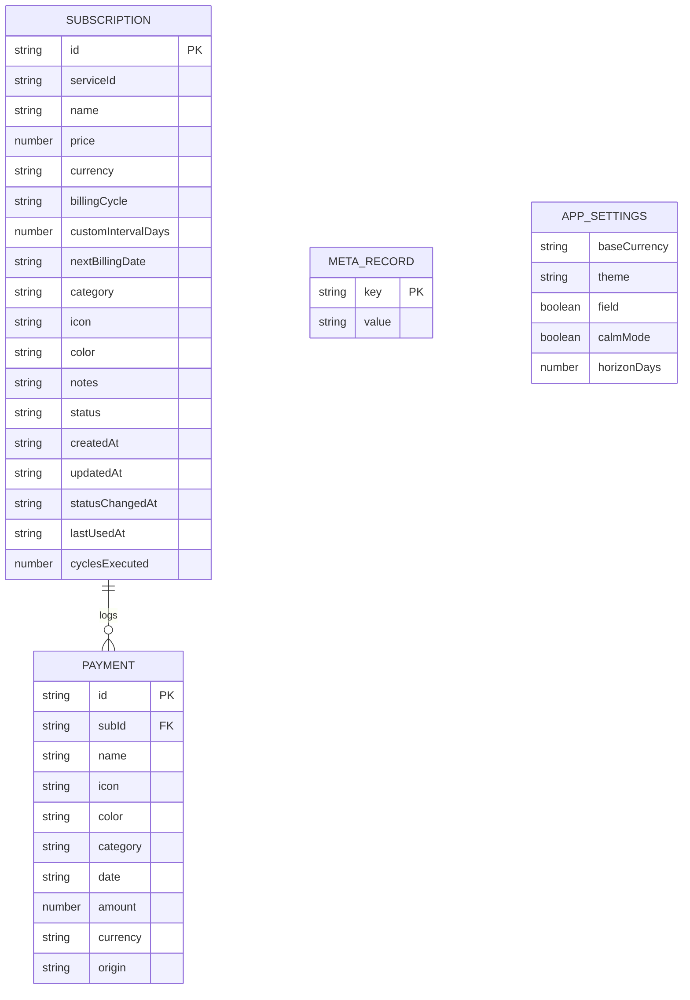
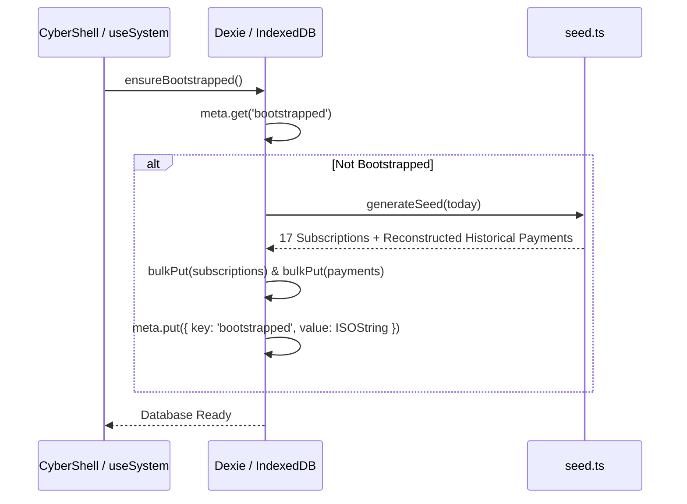

# SUBTRACK // ARCHITECTURAL SPECIFICATION & SYSTEM MANUAL
*A local-first, offline-capable Financial Operating System for recurring subscription management.*

> [!IMPORTANT]
> **MANDATE FOR AI AGENTS & DEVELOPERS (LIVING DOCUMENT PROTOCOL)**:
> This `AGENTS.md` file is the **single source of truth** for the entire Subtrack system.
> Whenever you modify, refactor, add features, update schemas, introduce new dependencies, or alter domain types/logic in this repository, you **MUST** update this file to reflect your changes immediately. Never allow this document to drift from active code.

---

## 1. Executive System Overview & Philosophy

### 1.1 Core Metaphor & Conceptual Model
Subtrack treats personal recurring finances not as passive spreadsheets, but as an **active operating system**:
- **Subscriptions are Processes**: A service you pay for is an ongoing background process running on your financial volume. It has a state (`active`, `suspended`, `terminated`), a cycle schedule, a resource consumption rate, and a deterministic process identifier (e.g. `SUB-41207`).
- **Money is Resource Consumption**: Charges represent compute/resource cycles. Subtrack normalizes all billing schedules (weekly, monthly, quarterly, yearly, custom) into **Burn Rate** (normalised currency consumed per month and per day).
- **Renewals are Scheduled Events**: A renewal is not an unexpected invoice; it is a deterministic occurrence on an execution schedule.
- **Your Device is the Host Volume**: There is no remote backend, no user account, no cloud database, and no telemetry. All state lives inside local IndexedDB storage (via Dexie.js), and works 100% offline.

```
+-----------------------------------------------------------------------------------+
|                                 SUBTRACK HOST                                    |
|                                                                                   |
|  +-----------------------------------------------------------------------------+  |
|  |                             PRESENTATION LAYER                              |  |
|  |  +---------------+  +---------------+  +---------------+  +---------------+ |  |
|  |  |   OVERVIEW    |  |     FLOW      |  | PAYMENT MATRIX|  |   INSIGHTS    | |  |
|  |  |  (Dashboard)  |  | (Subs Query)  |  | (12-Mo Heat)  |  |  (Analytics)  | |  |
|  |  +---------------+  +---------------+  +---------------+  +---------------+ |  |
|  +-----------------------------------------------------------------------------+  |
|                                        |                                          |
|  +-----------------------------------------------------------------------------+  |
|  |                        REACTIVE ORCHESTRATION LAYER                         |  |
|  |     Zustand UI Store  *  Dexie Live Queries  *  useSystem Reactive Hook     |  |
|  +-----------------------------------------------------------------------------+  |
|                                        |                                          |
|  +-----------------------------------------------------------------------------+  |
|  |                        BUSINESS LOGIC & ANALYTICS                           |  |
|  |    analytics.ts   *   money.ts   *   date.ts   *   cycle.ts   *   fuzzy.ts  |  |
|  +-----------------------------------------------------------------------------+  |
|                                        |                                          |
|  +-----------------------------------------------------------------------------+  |
|  |                           LOCAL STORAGE ENGINE                              |  |
|  |                   IndexedDB / Dexie.js (Schema V1)                          |  |
|  |           [subscriptions]        [payments]        [meta]                   |  |
|  +-----------------------------------------------------------------------------+  |
+-----------------------------------------------------------------------------------+
```

### 1.2 Non-Negotiable Engineering Principles
1. **Local-First & Offline Resilience**: The app must load in <50ms from cache, execute writes immediately to local storage, and remain fully functional with zero network connectivity.
2. **Deterministic Arithmetic**: Currency conversion, normalisation, and cycle derivations use strictly validated fixed-point math and static FX tables to avoid rounding drift or network reliance.
3. **Hardware-Inspired Cyber Brutalism**: The interface evokes high-reliability industrial instruments and terminals. It uses custom 45-degree cut-corner panels, monospace telemetry metrics, signal LEDs, ASCII borders, and micro labels.
4. **Zero Telemetry**: No third-party trackers, analytics pixels, remote fonts, or external API pings.

---

## 2. Repository Structure & Directory Topology

```
e:/Projects/Subtrack/
├── public/                       # Static PWA assets, icons, manifest
│   ├── favicon.svg
│   ├── icon-192.png
│   ├── icon-512.png
│   ├── manifest.webmanifest
│   └── robots.txt
├── scripts/                      # Build & verification utilities
│   ├── generate-icons.mjs        # Generates PWA icon assets
│   └── smoke.mjs                 # Headless smoke test runner
├── src/
│   ├── app/                      # Navigation & route configurations
│   │   └── nav.ts                # Main routes, labels, shortcuts, and blurbs
│   ├── components/
│   │   ├── brand/                # Branding, icons & typography
│   │   │   ├── ServiceBadge.tsx  # Styled container for service marks with accent strips
│   │   │   ├── ServiceGlyph.tsx  # Master brand icon resolver (react-icons + custom SVGs)
│   │   │   └── Wordmark.tsx      # Subtrack logo & status typography
│   │   ├── charts/               # Financial data visualisations
│   │   │   ├── BurnRail.tsx      # Multi-segment horizontal burn distribution bar
│   │   │   ├── CategoryBlock.tsx # Category allocation breakdown cards
│   │   │   └── SpendingSignal.tsx# Time-series sparkline & cash graph (SVG/Canvas)
│   │   ├── shell/                # Application framing, navigation & overlays
│   │   │   ├── CommandPalette.tsx# Global Command-K fuzzy search & action launcher
│   │   │   ├── CyberShell.tsx    # Root layout coordinator, responsive navigation
│   │   │   ├── FieldOverlay.tsx  # CRT dot-matrix & scanline canvas layer
│   │   │   ├── MobileNav.tsx     # Compact bottom dock for mobile viewports
│   │   │   ├── NavigationRail.tsx# Desktop sidebar navigation with live telemetry
│   │   │   ├── SystemFooter.tsx  # Minimalist status footer with telemetry & creator links
│   │   │   ├── SystemHeader.tsx  # Top bar with currency readout, search trigger, status
│   │   │   ├── SystemToaster.tsx # Terminal-style log notifications
│   │   │   └── UpdatePrompt.tsx  # PWA service worker reload coordinator
│   │   ├── subs/                 # Subscription-specific modules
│   │   │   ├── IncomingStream.tsx# Chronological timeline of upcoming renewals
│   │   │   ├── ProcessCard.tsx   # Subscription modules (Grid Card & Table Row views)
│   │   │   ├── SubscriptionComposer.tsx # Add/Edit modal with preset gallery
│   │   │   ├── SystemNotes.tsx   # Automated system diagnostics and recommendations
│   │   │   ├── TerminateDialog.tsx # Destruction confirmation modal
│   │   │   └── TerminationConsole.tsx # Global termination controller
│   │   └── ui/                   # Reusable atomic design system components
│   │       ├── AnimatedNumber.tsx# Spring-based numerical odometer transitions
│   │       ├── Controls.tsx      # Form switches, selects, armed buttons
│   │       ├── CutPanel.tsx      # Industrial 45-degree chamfered panel component
│   │       ├── CyberButton.tsx   # High-contrast action buttons with keycap hints
│   │       ├── CyberDatePicker.tsx# Cyberpunk calendar date selection dialog
│   │       ├── DataStrip.tsx     # Monospace telemetry instrument strips
│   │       ├── Icons.tsx         # Vector UI icon set
│   │       ├── Micro.tsx         # Section headers, keycaps, rules, code stamps
│   │       ├── Signal.tsx        # Status chips, LEDs, and category badges
│   │       └── Skeleton.tsx      # Loading states & empty state fallbacks
│   ├── hooks/                    # Reusable React hooks
│   │   ├── useElementWidth.ts    # ResizeObserver width tracking
│   │   ├── usePlatform.ts        # Keyboard traps, scroll locks, media queries
│   │   └── useSystem.ts          # Reactive Dexie live queries & analytics pipeline
│   ├── lib/                      # Core business logic & database engine
│   │   ├── analytics.ts          # Aggregations, burn calculations, diagnostics
│   │   ├── catalog.ts            # 50+ rich preset subscription definitions & tiers
│   │   ├── cx.ts                 # Ultra-fast class name merger utility
│   │   ├── cycle.ts              # Cycle arithmetic, intervals, occurrences
│   │   ├── date.ts               # Date math, leap-year handling, ISO formats
│   │   ├── db.ts                 # Dexie IndexedDB schemas, migrations, CRUD
│   │   ├── fuzzy.ts              # Custom fuzzy search scoring & query parser
│   │   ├── id.ts                 # Deterministic PID, TXN reference, and trace generators
│   │   ├── money.ts              # Currency conversions, FX rates, currency formatting
│   │   ├── portability.ts        # JSON snapshot backup/restore & CSV export
│   │   ├── seed.ts               # Default seed dataset generator
│   │   └── types.ts              # Domain TypeScript interfaces & schemas
│   ├── pages/                    # Route views
│   │   ├── Flow.tsx              # Registry list with query bar & density toggles
│   │   ├── Insights.tsx          # Analytics, concentration gauges, cycle mix
│   │   ├── NotFound.tsx          # 404 terminal diagnostic view
│   │   ├── Overview.tsx          # Primary command dashboard
│   │   ├── PaymentMatrix.tsx     # 12-month calendar matrix & payment stream
│   │   ├── ProcessDetail.tsx     # Hardware diagnostic board for a single subscription
│   │   └── Settings.tsx          # System configurations, FX reference, database controls
│   ├── store/
│   │   └── ui.ts                 # Zustand UI state store (modals, currency, theme)
│   ├── styles/                   # Design tokens, fonts, and base styling
│   │   ├── base.css              # Reset, typography, scrollbars, focus rings
│   │   ├── components.css        # Cut-corner clips, dot-fields, animations
│   │   ├── fonts.css             # Local font declarations
│   │   ├── index.css             # Root stylesheet imports
│   │   └── tokens.css            # OKLAB color tokens, semantic variables
│   ├── App.tsx                   # Route definitions & router bootstrap
│   └── main.tsx                  # Application entry point
├── index.html                    # HTML shell
├── package.json                  # Dependencies & scripts
├── tsconfig.json                 # TypeScript strict compiler config
└── vite.config.ts                # Vite build, PWA plugins, aliases
```

---

## 3. Data Architecture & Type Definitions

The schema is defined in [`src/lib/types.ts`](file:///e:/Projects/Subtrack/src/lib/types.ts).



### 3.1 Domain Schemas

#### `Subscription`
Represents an active, suspended, or terminated subscription process.
```typescript
export interface Subscription {
  id: string                   // UUID v4
  serviceId: string | null     // Preset catalog ID (e.g. 'netflix', 'chatgpt') or null
  name: string                 // Display name
  price: number                // Nominal price in native currency
  currency: string             // ISO 4217 currency code (e.g. 'INR', 'USD', 'EUR')
  billingCycle: BillingCycle   // 'weekly' | 'monthly' | 'quarterly' | 'yearly' | 'custom'
  customIntervalDays?: number  // Number of days if billingCycle === 'custom'
  nextBillingDate: string      // ISO 'YYYY-MM-DD' anchor date
  category: Category           // 'ai' | 'entertainment' | 'productivity' | 'cloud' | ...
  icon: string                 // Glyph key resolved by ServiceGlyph
  color: string                // Hex accent color (e.g. '#10A37F')
  notes: string                // User annotations and descriptions
  status: ProcessStatus        // 'active' | 'suspended' | 'terminated'
  createdAt: string            // ISO timestamp
  updatedAt: string            // ISO timestamp
  statusChangedAt?: string     // ISO timestamp when status last changed
  lastUsedAt?: string          // ISO date when user last marked active usage
  cyclesExecuted: number       // Monotonic count of billing cycles executed
}
```

#### `Payment`
Represents a concrete historical billing charge.
```typescript
export interface Payment {
  id: string                   // UUID v4
  subId: string                // Foreign key linking to Subscription.id
  name: string                 // Denormalised service name (survives sub purge)
  icon: string                 // Denormalised icon key
  color: string                // Denormalised color
  category: Category           // Denormalised category
  date: string                 // ISO 'YYYY-MM-DD' charge date
  amount: number               // Actual amount charged in native currency
  currency: string             // Currency code
  origin: 'derived' | 'confirmed' // 'derived' = auto-reconstructed; 'confirmed' = manual trigger
}
```

#### `Category`
The system categorizes every subscription into one of 9 discrete semantic domains:
```typescript
export type Category =
  | 'ai'             // AI & Intelligence (ChatGPT, Claude, Gemini, Cursor)
  | 'entertainment'  // Streaming & Media (Netflix, Disney+, Crunchyroll)
  | 'productivity'   // Work & Design (Notion, Figma, Slack, Jira)
  | 'cloud'          // Infrastructure & Storage (Google One, iCloud, AWS, Supabase)
  | 'music'          // Audio Streaming (Spotify, Apple Music, Tidal)
  | 'fitness'        // Health & Training (cult.fit, Strava, Headspace)
  | 'education'      // Learning & Reading (Coursera, Duolingo, Medium)
  | 'shopping'       // Delivery & Memberships (Amazon Prime, Swiggy, Zomato)
  | 'other'          // Security & Utilities (1Password, NordVPN, Bitwarden)
```

Each category maps to a semantic signal color in [`src/lib/types.ts`](file:///e:/Projects/Subtrack/src/lib/types.ts):
- `ai` -> `acid` (`#B7FF00` cyber green)
- `entertainment` -> `magenta` (`#FF2BD6` neon pink)
- `productivity` -> `blue` (`#00C8FF` cyber cyan)
- `cloud` -> `blue` (`#00C8FF`)
- `music` -> `orange` (`#FF7A00` safety orange)
- `fitness` -> `red` (`#FF304F` neon red)
- `education` -> `magenta` (`#FF2BD6`)
- `shopping` -> `orange` (`#FF7A00`)
- `other` -> `acid` (`#B7FF00`)

---

## 4. Local Database & Storage Engine (`src/lib/db.ts`)

Subtrack uses [Dexie.js](https://dexie.org/) as an asynchronous, typed wrapper over browser IndexedDB.

### 4.1 Schema Declaration
Database Name: `subtrack_db` (Version 1)
```typescript
class SubtrackDatabase extends Dexie {
  subscriptions!: Table<Subscription, string>
  payments!: Table<Payment, string>
  meta!: Table<MetaRecord, string>

  constructor() {
    super('subtrack_db')
    this.version(1).stores({
      subscriptions: 'id, serviceId, name, category, status, nextBillingDate, createdAt, updatedAt',
      payments: 'id, subId, date, category, origin, [subId+date]',
      meta: 'key',
    })
  }
}
```

### 4.2 Seed Workflow & History Reconstruction
When Subtrack boots on an empty volume, `ensureBootstrapped()` automatically seeds 17 realistic subscriptions with up to 18 months of historical payments reconstructed from their anchor cycles.



### 4.3 Monotonic Cycle Execution & Lifecycle Actions
Subtrack provides atomic database mutations in [`src/lib/db.ts`](file:///e:/Projects/Subtrack/src/lib/db.ts):

1. **`createSubscription(draft)`**:
   - Assigns a new UUID v4.
   - Computes initial next billing date.
   - Generates historical payments retroactively if initialized in the past.
   - Writes to IndexedDB.
2. **`executeCycle(subId)`**:
   - Confirms a scheduled payment for the subscription on its `nextBillingDate`.
   - Adds a new `Payment` record with `origin: 'confirmed'`.
   - Increments `cyclesExecuted` by 1.
   - Advances `nextBillingDate` forward by one interval using `nextOccurrence()`.
   - Updates `updatedAt`.
3. **`setProcessStatus(subId, status)`**:
   - Transitions state between `'active'`, `'suspended'`, and `'terminated'`.
   - Sets `statusChangedAt` timestamp.
4. **`reconcileSchedules(today)`**:
   - Scans all active subscriptions.
   - If `nextBillingDate < today`, advances the date cycle-by-cycle until `nextBillingDate >= today`.
   - **Crucial Feature**: Preserves original day-of-month anchors using `addMonthsSafe()`.
5. **`markUsed(subId, date)`**:
   - Updates `lastUsedAt = todayISO()`. Resets dormancy timers.
6. **`purgeSubscription(subId)`**:
   - Deletes the subscription record.
   - Preserves historical `Payment` records for ledger audit integrity.
7. **`wipeAll()` & `resetToSeed()`**:
   - Destructive maintenance operations with dual-confirmation triggers.

---

## 5. Calculation Engine & Financial Analytics (`src/lib/analytics.ts`)

Subtrack performs fast in-memory calculations over the subscription state.

### 5.1 Burn Rate Normalization Formulas

Let nominal price be $P$, currency conversion rate to base currency be $R$, and billing cycle be $C$:

$$\text{Monthly Normalisation Factor } M(C, \text{days}) = \begin{cases}
P \times \frac{365.25}{7 \times 12} \approx P \times 4.3482 & \text{if } C = \text{weekly} \\
P & \text{if } C = \text{monthly} \\
\frac{P}{3} & \text{if } C = \text{quarterly} \\
\frac{P}{12} & \text{if } C = \text{yearly} \\
P \times \frac{30.4375}{\text{days}} & \text{if } C = \text{custom}
\end{cases}$$

$$\text{Normalised Monthly Cost } \text{Monthly} = M(C, \text{days}) \times R$$
$$\text{Normalised Annual Load } \text{Annual} = \text{Monthly} \times 12$$
$$\text{Daily Burn Rate } \text{Daily} = \frac{\text{Monthly}}{30.4375} = \frac{\text{Annual}}{365.25}$$

### 5.2 Subscription View Object (`SubscriptionView`)
Created via `viewOf(sub, baseCurrency, today, totalMonthlyBurn)`:
```typescript
export interface SubscriptionView {
  sub: Subscription
  monthly: number           // Normalised monthly burn in base currency
  annual: number            // Normalised annual burn in base currency
  share: number             // Decimal percentage (0.0 to 1.0) of total system burn
  daily: number             // Daily equivalent burn in base currency
  next: NextCycleInfo       // { date, days, overdue, label }
  isDormant: boolean        // True if unused for >= 30 days
  isNew: boolean            // Initialized within the last 45 days
}
```

### 5.3 System Summary Pipeline (`summarizeSystem()`)
The `summarizeSystem(subscriptions, payments, baseCurrency, today)` function compiles global metrics in a single pass:
- **`activeCount`**, **`suspendedCount`**, **`terminatedCount`**
- **`monthlyBurn`**: Total monthly burn of all `active` subscriptions.
- **`annualLoad`**: `monthlyBurn * 12`
- **`dailyBurn`**: `annualLoad / 365.25`
- **`avgCost`**: `monthlyBurn / activeCount`
- **`categories`**: Array of category breakdown slices with normalized totals, shares, and counts.
- **`concentration`**: Top 3 subscriptions by cost and their combined share of total burn (e.g. `64.2%`).
- **`incoming30`**: Chronological list of payment events landing in the next 30 days.
- **`notes`**: Diagnostic system observations (dormancy warnings, renewal clusters, high load concentration).

---

## 6. Currency & FX Architecture (`src/lib/money.ts`)

Subtrack operates on a **Static Multi-Currency Reference Matrix**. It does not make third-party network requests for exchange rates, ensuring reliability, offline stability, and deterministic totals.

### 6.1 Supported Currencies & FX Matrix
Base rates are calibrated against USD:
```typescript
export const FX_RATES_TO_USD: Record<string, number> = {
  USD: 1.0,
  INR: 0.012,     // 1 USD ~ 83.33 INR
  EUR: 1.08,
  GBP: 1.27,
  CAD: 0.74,
  AUD: 0.66,
  JPY: 0.0067,    // 1 USD ~ 149 JPY
  SGD: 0.75,
  AED: 0.2723,
  CHF: 1.13,
}
```

### 6.2 Conversion Formula
To convert an amount $A$ from currency $S$ to target base currency $T$:

$$\text{Amount in USD } U = A \times \text{FX}(S)$$
$$\text{Amount in Target } T = \frac{U}{\text{FX}(T)} = A \times \frac{\text{FX}(S)}{\text{FX}(T)}$$

### 6.3 Money Formatting
- `formatMoney(amount, currency, options)`: Formats standard strings (e.g. `₹1,499.00`, `$20.00`).
- `splitMoney(amount, currency)`: Splits into `{ symbol: '₹', value: '1,499', fraction: '.00' }` for split-weight typography.
- `formatCompact(amount, currency)`: Outputs compact notation (e.g. `₹1.5k`, `$20`).

---

## 7. Date Arithmetic & Deterministic Engine (`src/lib/date.ts`)

Financial date calculations require strict anchor preservation. Adding 1 month to January 31 must produce February 28 (or 29 in leap year), but the anchor day (31) must not be lost on the next cycle.

### 7.1 Safe Month Addition (`addMonthsSafe`)
```typescript
export function addMonthsSafe(isoDate: string, monthsToAdd: number): string {
  const [yearStr, monthStr, dayStr] = isoDate.split('-')
  let year = parseInt(yearStr, 10)
  let month = parseInt(monthStr, 10)
  const anchorDay = parseInt(dayStr, 10)

  month += monthsToAdd
  while (month > 12) { month -= 12; year += 1 }
  while (month < 1)  { month += 12; year -= 1 }

  const daysInTargetMonth = getDaysInMonth(year, month)
  const targetDay = Math.min(anchorDay, daysInTargetMonth)

  return `${year}-${String(month).padStart(2, '0')}-${String(targetDay).padStart(2, '0')}`
}
```

### 7.2 Cycle Occurrence Computation (`occurrenceAt`)
Calculates the exact ISO date for the $N$-th occurrence from an anchor:
- **Weekly**: $\text{Anchor} + (N \times 7 \text{ days})$
- **Monthly**: $\text{Anchor} + N \text{ months (safe)}$
- **Quarterly**: $\text{Anchor} + (N \times 3 \text{ months (safe)})$
- **Yearly**: $\text{Anchor} + (N \times 12 \text{ months (safe)})$
- **Custom**: $\text{Anchor} + (N \times \text{customIntervalDays})$

---

## 8. Fuzzy Search & Command Query Parser (`src/lib/fuzzy.ts`)

Subtrack implements an in-memory search parser for the Command Palette and Flow query bar.

### 8.1 Query Syntax & Filter Extraction
The search bar accepts natural text as well as structured query tokens:
- **Numeric thresholds**: `>500`, `<1000`, `>=200`
- **Cycle filters**: `monthly`, `yearly`, `weekly`, `quarter`
- **Category filters**: `ai`, `entertainment`, `music`, `cloud`, `fitness`, `productivity`
- **Status tokens**: `active`, `suspended`, `terminated`, `on`, `off`
- **Month targets**: `sep`, `oct`, `nov`, `dec`
- **Currency matching**: `usd`, `inr`, `eur`

### 8.2 Scoring Algorithm
Matches are ranked by relevance:
1. Exact name match: `+100` points
2. Prefix name match: `+60` points
3. Substring match: `+40` points
4. Service alias match (e.g. typing `gpt` matches `chatgpt`): `+35` points
5. Category match: `+20` points
6. Notes match: `+10` points

---

## 9. Brand & Icon Resolver (`src/components/brand/ServiceGlyph.tsx`)

Every subscription displays its official, authentic brand vector mark via `react-icons` (Simple Icons, FontAwesome, Remix Icons, Tabler Icons) or dedicated custom SVGs.

### 9.1 Brand Registry
```typescript
const OFFICIAL_ICONS: Record<string, IconRenderer> = {
  // AI & Intelligence
  chatgpt: RiOpenaiFill,
  openai: RiOpenaiFill,
  claude: SiClaude,
  anthropic: SiClaude,
  gemini: SiGooglegemini,
  perplexity: SiPerplexity,
  cursor: CursorIcon,           // Custom 3D Isometric Cube
  deepseek: DeepSeekIcon,       // Custom Neural Star
  openrouter: OpenRouterIcon,   // Custom Node Router
  midjourney: MidjourneyIcon,   // Custom Sailboat Mark
  copilot: SiGithubcopilot,

  // Entertainment & Music
  netflix: SiNetflix,
  spotify: SiSpotify,
  youtube: SiYoutube,
  prime: FaAmazon,
  hotstar: TbBrandDisney,
  appletv: SiAppletv,
  crunchyroll: SiCrunchyroll,
  max: SiMax,
  hbo: SiHbo,
  paramount: SiParamountplus,
  applemusic: SiApplemusic,
  audible: SiAudible,
  tidal: SiTidal,
  soundcloud: SiSoundcloud,
  deezer: SiDeezer,

  // Productivity, Dev & Cloud
  notion: SiNotion,
  figma: SiFigma,
  canva: CanvaIcon,             // Custom Official Script Vector
  adobe: TbBrandAdobe,
  microsoft: FaMicrosoft,
  linear: SiLinear,
  slack: FaSlack,
  jira: SiJira,
  miro: SiMiro,
  github: SiGithub,
  gitlab: SiGitlab,
  vercel: SiVercel,
  supabase: SiSupabase,
  docker: SiDocker,
  kubernetes: SiKubernetes,
  aws: FaAws,
  digitalocean: SiDigitalocean,
  cloudflare: SiCloudflare,
  googleone: TbBrandGoogleOne,
  googledrive: SiGoogledrive,
  icloud: SiIcloud,
  dropbox: SiDropbox,

  // Security & Utilities
  onepassword: Si1Password,
  bitwarden: SiBitwarden,
  nordvpn: SiNordvpn,
  proton: SiProtonmail,
  lastpass: SiLastpass,
  expressvpn: SiExpressvpn,

  // Fitness & Learning
  cultfit: CultfitIcon,         // Custom Geometric Runner
  strava: SiStrava,
  fitbit: SiFitbit,
  peloton: SiPeloton,
  headspace: SiHeadspace,
  coursera: SiCoursera,
  duolingo: SiDuolingo,
  medium: SiMedium,
  substack: SiSubstack,

  // Gaming & Social
  playstation: SiPlaystation,
  xbox: FaXbox,
  nintendo: TbDeviceNintendo,
  discord: SiDiscord,
  x: SiX,
  twitter: SiX,
  linkedin: FaLinkedin,
  twitch: SiTwitch,
  steam: SiSteam,
  zoom: SiZoom,
  telegram: FaTelegram,
  whatsapp: FaWhatsapp,
  reddit: FaReddit,
  instagram: FaInstagram,
  tiktok: FaTiktok,
  swiggy: SiSwiggy,
  zomato: SiZomato,
  uber: SiUber,
  airbnb: SiAirbnb,
}
```

### 9.2 Fallback Strategy
If a custom service name is entered that doesn't match any known alias, `ServiceGlyph` renders a clean, bold geometric monogram of the service's initial character in JetBrains Mono inside the themed `ServiceBadge`.

---

## 10. User Interface & Design System (`src/styles/`)

Subtrack employs a tailored **Cyber Brutalist / Terminal OS** aesthetic designed in OKLAB color space.

### 10.1 Color System & Tokens (`tokens.css`)

```
================================================================================
TOKEN           NIGHT (DARK MODE)               DAYLIGHT (LIGHT MODE)
================================================================================
--c-bg          oklab(0.13 0 0) [#0d0d0d]       oklab(0.975 0 0) [#f8f8f8]
--c-surface     oklab(0.18 0 0) [#181818]       oklab(0.94 0 0)  [#efefef]
--c-surface2    oklab(0.22 0 0) [#242424]       oklab(0.91 0 0)  [#e5e5e5]
--c-line        rgb(255 255 255 / 0.12)        rgb(0 0 0 / 0.14)
--c-linehard    rgb(255 255 255 / 0.28)        rgb(0 0 0 / 0.38)
--c-fg          oklab(0.96 0 0) [#f5f5f5]       oklab(0.08 0 0)  [#0a0a0a]
--c-fg-dim      rgb(255 255 255 / 0.72)        rgb(10 10 10 / 0.88)
--c-fg-faint    rgb(255 255 255 / 0.44)        rgb(10 10 10 / 0.74)
--c-acid        oklab(0.91 -0.22 0.23) [#B7FF00] oklab(0.68 -0.19 0.18) [#4d9900]
--c-blue        oklab(0.82 -0.11 -0.15) [#00C8FF]oklab(0.55 -0.12 -0.22) [#0068b5]
--c-magenta     oklab(0.72 0.26 -0.05) [#FF2BD6] oklab(0.58 0.24 -0.06) [#c20088]
--c-orange      oklab(0.78 0.14 0.18) [#FF7A00] oklab(0.62 0.15 0.16) [#b84700]
--c-red         oklab(0.66 0.24 0.12) [#FF304F] oklab(0.54 0.22 0.11) [#c40024]
================================================================================
```

### 10.2 Industrial Cut Corners (Chamfer Geometry)
Subtrack renders geometric chamfered corners using CSS polygon clipping paths:
- **`clip-cut-tl`**: Top-left chamfer (`polygon(14px 0, 100% 0, 100% 100%, 0 100%, 0 14px)`)
- **`clip-cut-br`**: Bottom-right chamfer (`polygon(0 0, 100% 0, 100% calc(100% - 14px), calc(100% - 14px) 100%, 0 100%)`)
- **`clip-cut-both`**: Top-left and bottom-right chamfer (`CutPanel`)

### 10.3 Typography Hierarchy
- **UI Display & Headers**: `Space Grotesk`, sans-serif (Weights: 500, 600, 700)
- **Financial Telemetry & Numerals**: `JetBrains Mono`, monospace (Weights: 400, 500, 700)

---

## 11. Core Feature Boards & Pages (`src/pages/`)

### 11.1 Overview (`/`)
The main flight deck:
- **Top Instrument Strip**: Total monthly burn, annual load, active subscription count, average subscription cost.
- **Load Distribution Bar (`BurnRail`)**: Segmented horizontal breakdown showing proportionate burden by category.
- **Incoming Payment Stream (`IncomingStream`)**: Chronological queue of upcoming renewals in the next 30 days.
- **Quick Subscription Grid**: Most active services with instant diagnostic shortcuts.

### 11.2 Flow (`/flow`)
The central subscription registry:
- **Search & Query Bar**: Full keyword, status, category, and numeric filter engine.
- **Density Switcher**: Instant transition between module Grid Card density and compact high-density List scanline view.
- **Sorting Engine**: Sort by monthly cost, next cycle date, name, or cycles executed.

### 11.3 Process Diagnostic Detail (`/flow/:id`)
Hardware-inspired diagnostic station for a single subscription:
- **Identity & Economics Header**: Service badge, live nominal price, normalized burn readout, next billing countdown.
- **Control Rail**: Confirm Cycle trigger, Suspend/Resume toggle, Edit, and Terminate.
- **Metadata Register**: Initialized date, record age, cycles executed, last usage confirmation date, anchor day.
- **Payment History Ledger**: Paginated, reverse-chronological table of confirmed and derived charges with transaction hashes.
- **Spending Signal Sparkline**: Visual trend of recorded monthly spend.

### 11.4 Payment Matrix (`/matrix`)
12-month forward/backward financial projection heatmap:
- **Month Carousel**: Navigate through upcoming and past months.
- **Calendar Heat Grid**: Every day of the month shows scheduled charge indicators and daily totals.
- **Day Event Drawer**: Inspect individual day charges and calculate exact cash required.

### 11.5 Insights (`/insights`)
Deep financial intelligence:
- **Concentration Gauges**: Top 3 subscription load percentage, active-to-total ratio.
- **Dormant Spend Diagnosis**: Identifies subscriptions with no recorded activity in 30+ days and calculates potential annual savings.
- **Category Allocation**: Multi-segment visual decomposition by spend category.
- **Billing Cycle Mix**: Distribution between monthly, annual, quarterly, and custom cycles.
- **Longest Running & Newest Records**: Historical tenure tracking.

### 11.6 Settings (`/settings`)
System control and backup room:
- **Appearance**: Theme selection (`Night // Primary` vs `Daylight // Brutalist`), field overlay toggle, calm motion mode.
- **Base Currency**: Select global normalization currency (INR, USD, EUR, GBP, CAD, AUD, JPY, SGD, AED, CHF).
- **Volume Operations**:
  - **Export JSON Snapshot**: Full database dump.
  - **Export CSV Ledger**: Formatted ledger rows for Excel/Sheets.
  - **Import JSON Snapshot**: Volume restore with confirmation.
  - **Reset to Demo Dataset**: Loads 17 realistic sample subscriptions.
  - **Purge All Data**: Cleans database.
- **System Specs & Creator Credit**: Details platform build, schema version, and creator link ([`Hariharen`](https://hariharen.site)).

---

## 12. Application State & Global Store (`src/store/ui.ts`)

Global UI transient state is handled by Zustand:

```typescript
interface UIState {
  // Theme & Appearance
  theme: 'dark' | 'day'
  field: boolean
  calmMode: boolean
  baseCurrency: string
  horizonDays: number

  // Modals & Drawers
  composer: { open: boolean; editId?: string; presetServiceId?: string }
  termination: { open: boolean; subId?: string; mode: 'terminate' | 'purge' }
  paletteOpen: boolean

  // Toasts
  toasts: ToastRecord[]

  // Actions
  openComposer: (opts?: { editId?: string; presetServiceId?: string }) => void
  closeComposer: () => void
  openTermination: (subId: string, mode?: 'terminate' | 'purge') => void
  closeTermination: () => void
  setPaletteOpen: (open: boolean) => void
  pushToast: (toast: Omit<ToastRecord, 'id' | 'createdAt'>) => void
  dismissToast: (id: string) => void
}
```

---

## 13. Global Keyboard Shortcut Register

| Shortcut | Scope | Action |
| :--- | :--- | :--- |
| `⌘ + K` or `Ctrl + K` | Global | Toggle Command Palette |
| `/` | Global | Focus global search / query subscriptions |
| `N` | Global | Open New Subscription Composer |
| `1` | Global | Navigate to **Overview** (`/`) |
| `2` | Global | Navigate to **Flow** (`/flow`) |
| `3` | Global | Navigate to **Payment Matrix** (`/matrix`) |
| `4` | Global | Navigate to **Insights** (`/insights`) |
| `5` | Global | Navigate to **Settings** (`/settings`) |
| `T` | Global | Toggle Night / Daylight theme |
| `ESC` | Global | Close active modal, sheet, drawer, or palette |
| `↑` / `↓` | Palette | Navigate search results |
| `Enter` | Palette | Execute selected command or open subscription |

---

## 14. Progressive Web App (PWA) & Build Strategy

- **Build Tool**: Vite 8 with `@vitejs/plugin-react` and `@tailwindcss/vite`.
- **PWA Plugin**: `vite-plugin-pwa` with `generateSW` Workbox strategy.
- **Precache**: All HTML, JavaScript chunks, CSS stylesheets, SVGs, and web fonts are precached into the CacheStorage API.
- **Service Worker Lifecycle**: `UpdatePrompt.tsx` prompts the user when a new ServiceWorker build is ready to activate via `skipWaiting()`.

---

## 15. Extension & Developer Guidelines

### How to Add a New Service Preset
1. Open [`src/lib/catalog.ts`](file:///e:/Projects/Subtrack/src/lib/catalog.ts).
2. Append a new `CatalogService` object to `SERVICE_CATALOG`:
   ```typescript
   {
     id: 'my-service',
     name: 'My Service',
     category: 'ai',
     price: 999,
     cycle: 'monthly',
     color: '#HEX_COLOR',
     glyph: 'my-service-glyph',
     tiers: [{ label: 'Pro', price: 999, cycle: 'monthly' }],
     aliases: ['custom', 'search', 'terms']
   }
   ```
3. Open [`src/components/brand/ServiceGlyph.tsx`](file:///e:/Projects/Subtrack/src/components/brand/ServiceGlyph.tsx).
4. Map `'my-service-glyph'` in `OFFICIAL_ICONS` to a `react-icons` component or custom SVG.
5. Add keyword resolution rules in `resolveIcon()`.
6. Run `pnpm run typecheck` and `npx vite build` to ensure clean verification.

---

## 16. AI Agent Maintenance Protocol & Living Document Mandate

To maintain code health and preserve institutional memory across agentic sessions, all future AI coding agents, assistants, and human contributors must adhere to the following operational protocols:

### 16.1 The "Update on Change" Rule
If your task involves any of the following, you **MUST** update `AGENTS.md` before concluding your turn:
1. **Schema or Type Modifications**: Adding or modifying fields in `Subscription`, `Payment`, `Category`, `BillingCycle`, or Dexie database stores.
2. **New Routes or Views**: Introducing a new route in `App.tsx` or modifying page layout topologies.
3. **New UI Components / Primitives**: Adding core reusable components to `src/components/ui/`, `src/components/charts/`, or `src/components/shell/`.
4. **New Catalog Services or Brand Icons**: Adding presets to `src/lib/catalog.ts` or modifying icon resolution maps in `src/components/brand/ServiceGlyph.tsx`.
5. **State Management Changes**: Adding slices or actions to `src/store/ui.ts`.
6. **Design System & Token Adjustments**: Modifying CSS variables in `tokens.css`, `components.css`, or changing the OKLAB color palettes.
7. **PWA / Build Tooling Alterations**: Modifying `vite.config.ts`, Service Worker caching strategies, or dependency trees.

### 16.2 Integrity Checklist for Future Agents
Before finishing any task, run through this verification checklist:
- [ ] `pnpm run typecheck` exits with `code 0` (zero TypeScript errors).
- [ ] `npx vite build` succeeds without bundling errors.
- [ ] No placeholder components or mocked broken links exist.
- [ ] `AGENTS.md` accurately documents any new functionality added.
- [ ] Terminology remains consistent: **"Subscriptions" / "Subs"** for user-facing copy, **"Processes"** only for internal OS metaphorical semantics.

---
*SUBTRACK // ARCHITECTURE SPECIFICATION COMPLETE — LOCAL-FIRST FINANCIAL OPERATING SYSTEM*

